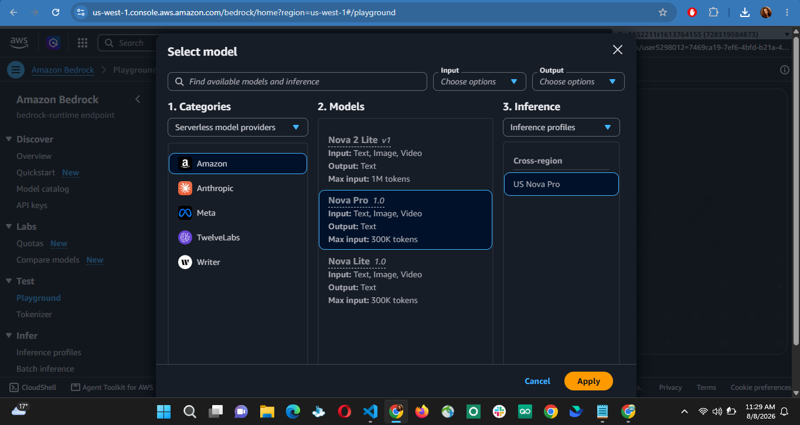

# Exercise Deliverable: Technical Documentation Assistant (Role-Based Prompting)

**Model:** Amazon Nova Pro (`amazon.nova-pro-v1:0`) — Bedrock Playground

**Parameters used:** — Temperature 1, Top-P 1, Max tokens 2560

---

## Sample Input (used for every task below)

```
added caching for product listings - deployed tuesday

before: every request hit the db directly
now: cache results in redis, expire after 5 min then refetch from db

why: product page was slow during peak hours, db cpu kept spiking

what we handle:
- cache miss: falls through to db, result gets cached for next request
- product updated: we clear the cache entry when a product is saved
- sold-out items: might still show as available for up to 5 min. known tradeoff, acceptable for now

still to do: add metrics to track cache hit rate. also might need to tune the 5 min ttl depending on how often products change
```

---

## Task 1 — Baseline (No Role)

**Prompt sent:**
```
Turn these notes into documentation.

<engineering_notes>
added caching for product listings - deployed tuesday

before: every request hit the db directly
now: cache results in redis, expire after 5 min then refetch from db

why: product page was slow during peak hours, db cpu kept spiking

what we handle:
- cache miss: falls through to db, result gets cached for next request
- product updated: we clear the cache entry when a product is saved
- sold-out items: might still show as available for up to 5 min. known tradeoff, acceptable for now

still to do: add metrics to track cache hit rate. also might need to tune the 5 min ttl depending on how often products change
</engineering_notes>
```

**Model output:**

### Documentation: Caching Implementation for Product Listings

#### Overview
A caching mechanism has been added to improve the performance of product listings on our platform. This change was deployed on Tuesday.

#### Previous Behavior
- Every request for product listings directly hit the database.

#### Current Behavior
- Results are now cached in Redis.
- Cached results expire after 5 minutes, after which a refetch from the database occurs.

#### Motivation
The product page experienced significant slowdowns during peak hours, leading to spikes in database CPU usage. Caching was implemented to mitigate these performance issues.

#### Caching Logic
1. **Cache Miss**: 
   - If a requested product listing is not found in the cache (cache miss), the system falls back to querying the database.
   - The result from the database is then cached for subsequent requests.

2. **Product Updates**:
   - When a product is updated or saved, the corresponding cache entry is cleared to ensure that the latest information is fetched on the next request.

3. **Sold-Out Items**:
   - There is a known tradeoff where sold-out items might still appear as available for up to 5 minutes. This has been deemed an acceptable limitation for the current implementation.

#### To-Do List
1. **Add Metrics**:
   - Implement tracking for cache hit rate to monitor the effectiveness of the caching strategy.
   
2. **Tune TTL**:
   - Evaluate the 5-minute Time To Live (TTL) based on the frequency of product changes. Adjustments may be necessary to optimize performance and data freshness.

**Observations:**

Structure was already fairly organized by default — headings, bullets, even a numbered list for the TTL/metrics items — with no role instruction given. This means structure alone isn't the right thing to credit later for any improvement from role-based prompting; the difference has to be something more specific than "now it has headings."

Tone wasn't neutral despite no role being specified — it drifted corporate on its own ("Overview," "Conclusion," phrases like "addressed the performance bottlenecks"). This is a baseline characteristic, not something introduced later.

All five substantive items from the notes are present — cache miss, invalidation on save, sold-out staleness tradeoff, metrics TODO, TTL-tuning TODO. Nothing dropped. Completeness was already solid at baseline, so later improvements need to be judged on something other than item retention.

The real issue is fabrication. The Conclusion invents claims the notes don't make: the notes describe the sold-out tradeoff as "acceptable for now" — a hedge — but the output asserts the change "has addressed the performance bottlenecks" and that "ongoing monitoring... will ensure this solution continues to meet our performance requirements." Neither claim is supported by the notes. Nobody said the fix worked, and nobody promised future monitoring — this is the model manufacturing confidence and a forward commitment that isn't there.

No length limit was set, and the output ran long, including an unnecessary summary section — a useful baseline number to compare against the 200-word cap used later.

**Net:** the baseline's problem isn't structure or missing items — it's that the model editorializes and asserts outcomes beyond what the source supports. That's the specific behavior later prompt versions need to be checked against.

---

## Task 2 — Initial Role-Based Prompt

**Prompt sent:**
```
You are a senior technical writer within a software engineering organization,
writing internal documentation for other software engineers who will maintain
this system later. Your audience already understands general software
architecture but has no context on this specific change.

Convert the engineering notes below into internal documentation using clear
section headings and bullet points where appropriate.

<engineering_notes>
added caching for product listings - deployed tuesday

before: every request hit the db directly
now: cache results in redis, expire after 5 min then refetch from db

why: product page was slow during peak hours, db cpu kept spiking

what we handle:
- cache miss: falls through to db, result gets cached for next request
- product updated: we clear the cache entry when a product is saved
- sold-out items: might still show as available for up to 5 min. known tradeoff, acceptable for now

still to do: add metrics to track cache hit rate. also might need to tune the 5 min ttl depending on how often products change
</engineering_notes>
```

**Model output:**
## Internal Documentation: Caching Implementation for Product Listings

### Overview
This document outlines the recent changes made to implement caching for product listings to improve performance during peak hours. The changes were deployed on Tuesday.

### Before the Change
- Every request for product listings directly hit the database.

### After the Change
- Results are now cached in Redis.
- Cached results expire after 5 minutes and are then refetched from the database.

### Motivation
- The product page experienced slow load times during peak hours.
- Database CPU usage was spiking, indicating inefficient query handling.

### Caching Mechanism
#### Cache Miss
- If a requested product listing is not found in the cache (cache miss), the system falls through to the database.
- The result from the database is then cached for subsequent requests.

#### Product Updates
- When a product is updated or saved, the corresponding cache entry is cleared to ensure the latest data is fetched on the next request.

#### Sold-Out Items
- There is a known tradeoff where sold-out items might still show as available for up to 5 minutes.
- This is considered an acceptable limitation for now.

### Known Tradeoffs
- **Sold-Out Items:** May display as available for up to 5 minutes due to caching.

### To-Do List
- **Add Metrics:** Implement tracking for cache hit rate to monitor effectiveness.
- **Tune TTL:** Evaluate and possibly adjust the 5-minute Time To Live (TTL) based on the frequency of product changes.

**Comparison to Task 1 baseline:**

Fabrication was partially improved, not fixed. Task 1's conclusion asserted the fix "has addressed the performance bottlenecks" — a false claim of settled success. Task 2 hedges to "aims to reduce... and improve," which is more defensible language, but it still closes with "continuous monitoring and potential adjustments will be necessary" — an invented forward-looking commitment. Nothing in the notes says monitoring is planned or necessary; the notes just say metrics aren't built yet. So role framing softened the overclaiming but didn't eliminate the pattern of asserting things beyond the source.

Structure got worse, not better. This version has a redundant "Known Tradeoffs" section that repeats the "Sold-Out Items" bullet already covered under "Caching Mechanism," word-for-word in substance. That's padding structure for its own sake — the kind of thing a stricter output spec should prevent. Structure did not actually improve from Task 1 to Task 2; it added a layer of headings without adding information, and introduced a duplication Task 1 didn't have.

Completeness stayed fully intact — same five items present, no change from baseline. The role framing shouldn't get credit here for something the baseline already got right.

Length increased rather than decreased. If role-based prompting were expected to improve tightness, this run contradicts that — adding a role produced more sections, more headings, more words, not fewer.

---

## Task 3 — Refined Prompt

Addresses: **output structure**, **handling of incomplete items**, and **fabrication risk** (three of the four suggested refinements).

**Prompt sent:**
```
You are a senior technical writer embedded in a software engineering team.
You write internal documentation for other engineers who will read it weeks
or months later, without the context the original author had.

AUDIENCE: Software engineers with general technical background, but no
prior knowledge of this specific change.

OUTPUT FORMAT — use exactly these headings, in this order. Omit a heading
only if the notes contain no relevant content for it:

## Summary
One to two sentences on what changed, including when it was deployed if
the notes state a date.

## Motivation
Why the change was made, based only on what the notes state.

## Implementation
Bullet points describing current behavior.

## Behavior & Edge Cases
Bullet points for specific scenarios and how the system handles each one.

## Known Tradeoffs / Limitations
Bullet points for anything explicitly called out as an accepted tradeoff.

## Open Items
Bullet points for unfinished work or follow-ups, taken directly from the
"still to do" / open items in the notes. Do not mark anything as complete
if the notes describe it as pending.

CONSTRAINTS:
- Every fact from the notes must appear in the output exactly once, under
  its single most relevant heading. Do not repeat the same fact under
  multiple headings, even in different wording.
- Do not omit any item from the notes, including dates, deployment
  timing, or "still to do" items — every distinct fact in the source
  notes must map to exactly one place in the output.
- Do not invent, infer, or add any detail, metric, or behavior not
  explicitly stated in the notes.
- Do not use marketing or hype language ("robust," "seamless,"
  "significantly improved," etc.).
- Keep total output under 200 words.
- Plain, direct, technical language only. No filler sentences.

<engineering_notes>
added caching for product listings - deployed tuesday

before: every request hit the db directly
now: cache results in redis, expire after 5 min then refetch from db

why: product page was slow during peak hours, db cpu kept spiking

what we handle:
- cache miss: falls through to db, result gets cached for next request
- product updated: we clear the cache entry when a product is saved
- sold-out items: might still show as available for up to 5 min. known tradeoff, acceptable for now

still to do: add metrics to track cache hit rate. also might need to tune the 5 min ttl depending on how often products change
</engineering_notes>
```

**Model output:**
## Summary
Added caching for product listings, deployed on Tuesday.

## Motivation
Product page was slow during peak hours, causing DB CPU spikes.

## Implementation
- Cache results in Redis.
- Cache expires after 5 minutes, then refetches from DB.

## Behavior & Edge Cases
- Cache miss: falls through to DB, result gets cached for next request.
- Product updated: clears the cache entry when a product is saved.
- Sold-out items: may still show as available for up to 5 minutes.

## Known Tradeoffs / Limitations
- Sold-out items may show as available for up to 5 minutes.

## Open Items
- Add metrics to track cache hit rate.
- May need to tune the 5-minute TTL based on product change frequency.

This block is your first Task 3 run (the one that dropped the deploy date). You now have a second run with a revised prompt, so this needs to become two sections: the original comparison, then a retest note. Don't overwrite the original — the fact that the first attempt failed and you had to iterate is itself part of the finding.

**Comparison to Task 2:**

Real progress here, but not a clean fix.

Fabrication is fixed. No Conclusion section, no invented claims about success or future monitoring. This is the one clear win from the explicit constraints — the anti-fabrication instruction did what role framing alone couldn't.

But it dropped an item, which violates the prompt's own constraint. The notes explicitly state "deployed tuesday" — that's missing from this output entirely. The Task 3 prompt requires that "every bullet in the source notes should map to something in the output," so this output fails its own spec. Task 1 and Task 2 both kept the deploy date; Task 3 lost it. This is exactly the kind of failure the verification checklist is meant to catch, and it undercuts a clean "Task 3 solved it" narrative.

Duplication is still not eliminated. The sold-out-items line appears near-verbatim in both "Behavior & Edge Cases" and "Known Tradeoffs / Limitations" — the same issue carried forward from Task 2, just inside a tighter format. The explicit section list didn't stop the model from restating the same fact under two different headings. Fixing this would need an instruction like "state each fact once, under its most relevant heading only" — the sections were assumed to be mutually exclusive, but the model wasn't told that.

Length stayed well under the 200-word cap, so that constraint held. Structure matched the spec exactly, with no extra sections invented.

Overall: this first version of Task 3 fixed fabrication and length, but introduced a new completeness failure (dropped deploy date) and didn't resolve the duplication issue from Task 2. Explicit constraints traded one failure mode for control over others rather than producing a complete fix.

**Retest with revised constraints:**

The prompt was revised to explicitly require that every fact appear exactly once under its single most relevant heading, and to call out dates and deployment timing as items that can't be dropped. Rerunning against the same notes: the deploy date issue was resolved — "deployed on Tuesday" now appears in the Summary. The duplication issue was not resolved — the sold-out-items fact still appears under both "Behavior & Edge Cases" and "Known Tradeoffs / Limitations" despite the explicit instruction against it.

This is a useful distinction rather than a loose end: the missing-item failure responded directly to a more specific instruction, while the duplication failure did not, even when the instruction was made explicit. That suggests the model treats "behavior" and "tradeoff" as legitimately separate categories that both warrant mentioning the same fact, rather than recognizing it as one fact stated twice — a plain-language "don't repeat yourself" constraint isn't specific enough to override that. Resolving it would likely require an explicit rule about which heading takes precedence when a fact could fit under more than one (e.g., "if a behavior is also a limitation, state it once under Known Tradeoffs and exclude it from Behavior & Edge Cases").

Final state: fabrication, length, and completeness (deploy date) are resolved. Duplication remains a known limitation of this prompt version.

---

## Task 4 — Experiment

**Variable changed:** Prompt placement. Role, output format, and constraints
were moved from the single bundled user message (used in Task 1–3) into the
dedicated System Prompt field, with only the engineering notes sent as the
user/chat message. Audience and wording of instructions were held identical
to the revised Task 3 prompt. Model parameters (temperature 1, top-p 1, max
tokens 2560) were also held constant, so prompt placement is the only
variable that changed between Output A and Output B.

**System Prompt field (Task 4):**
```
You are a senior technical writer embedded in a software engineering team.
You write internal documentation for other engineers who will read it weeks
or months later, without the context the original author had.

AUDIENCE: Software engineers with general technical background, but no
prior knowledge of this specific change.

OUTPUT FORMAT — use exactly these headings, in this order. Omit a heading
only if the notes contain no relevant content for it:

## Summary
One to two sentences on what changed, including when it was deployed if
the notes state a date.

## Motivation
Why the change was made, based only on what the notes state.

## Implementation
Bullet points describing current behavior.

## Behavior & Edge Cases
Bullet points for specific scenarios and how the system handles each one.

## Known Tradeoffs / Limitations
Bullet points for anything explicitly called out as an accepted tradeoff.

## Open Items
Bullet points for unfinished work or follow-ups, taken directly from the
"still to do" / open items in the notes. Do not mark anything as complete
if the notes describe it as pending.

CONSTRAINTS:
- Every fact from the notes must appear in the output exactly once, under
  its single most relevant heading. Do not repeat the same fact under
  multiple headings, even in different wording.
- Do not omit any item from the notes, including dates, deployment
  timing, or "still to do" items — every distinct fact in the source
  notes must map to exactly one place in the output.
- Do not invent, infer, or add any detail, metric, or behavior not
  explicitly stated in the notes.
- Do not use marketing or hype language ("robust," "seamless,"
  "significantly improved," etc.).
- Keep total output under 200 words.
- Plain, direct, technical language only. No filler sentences.
```

**User/chat message (Task 4):**
```
<engineering_notes>
added caching for product listings - deployed tuesday

before: every request hit the db directly
now: cache results in redis, expire after 5 min then refetch from db

why: product page was slow during peak hours, db cpu kept spiking

what we handle:
- cache miss: falls through to db, result gets cached for next request
- product updated: we clear the cache entry when a product is saved
- sold-out items: might still show as available for up to 5 min. known tradeoff, acceptable for now

still to do: add metrics to track cache hit rate. also might need to tune the 5 min ttl depending on how often products change
</engineering_notes>
```

**Output A — Task 3 (bundled: role + format + constraints + notes all in one user message):**
```
## Summary
Added caching for product listings, deployed on Tuesday.
## Motivation
Product page was slow during peak hours, causing DB CPU spikes.
## Implementation
- Cache results in Redis.
- Cache expires after 5 minutes, then refetches from DB.
## Behavior & Edge Cases
- Cache miss: falls through to DB, result gets cached for next request.
- Product updated: clears the cache entry when a product is saved.
- Sold-out items: may still show as available for up to 5 minutes.
## Known Tradeoffs / Limitations
- Sold-out items may show as available for up to 5 minutes.
## Open Items
- Add metrics to track cache hit rate.
- May need to tune the 5-minute TTL based on product change frequency.
```

**Output B — Task 4 (system prompt + separate user message):**
```
## Summary
Added caching for product listings using Redis, deployed on Tuesday.
## Motivation
Product page was slow during peak hours, causing database CPU spikes.
## Implementation
- Cache results in Redis.
- Cache expires after 5 minutes, then refetches from the database.
## Behavior & Edge Cases
- Cache miss: Fetches from the database, then caches the result.
- Product updated: Clears the cache entry when a product is saved.
- Sold-out items: May show as available for up to 5 minutes.
## Known Tradeoffs / Limitations
- Sold-out items may show as available for up to 5 minutes.
## Open Items
- Add metrics to track cache hit rate.
- Possibly tune the 5-minute TTL based on product change frequency.
```

**What changed:**

Moving the role and constraints into the System Prompt field made no
measurable difference to output quality. The deploy date is retained in
both versions. The sold-out-items fact is still duplicated verbatim across
"Behavior & Edge Cases" and "Known Tradeoffs / Limitations" in both
outputs — identical to the failure observed in Task 3. Structure, length,
and level of technical detail are effectively unchanged between the two
runs; differences are limited to minor wording (e.g. "Fetches from the
database" vs. "falls through to DB").

This is a meaningful negative result rather than an absence of findings.
It indicates the duplication issue is not an artifact of how the prompt
was assembled — single bundled message versus system/user split — but a
more fundamental tendency in how the model resolves overlapping
categories. The model treats "a behavior worth noting" and "a tradeoff
worth noting" as independently valid reasons to restate the same fact,
regardless of where the instruction against that lives in the prompt.
Fixing it will likely require resolving the ambiguity directly — for
example, explicit heading precedence stating that a fact belonging to
both Behavior & Edge Cases and Known Tradeoffs should be placed only under
Known Tradeoffs — rather than relocating or rephrasing the existing
instruction.

---

## Verification Checklist

- [ ] Every item in the source notes appears in the output (cache miss,
      product-updated invalidation, sold-out 5-min staleness tradeoff,
      metrics TODO, TTL-tuning TODO)
- [ ] No fabricated detail (no invented cache size, no invented metric
      values, no invented timeline)
- [ ] Consistent heading/bullet structure
- [ ] Under the stated word limit
