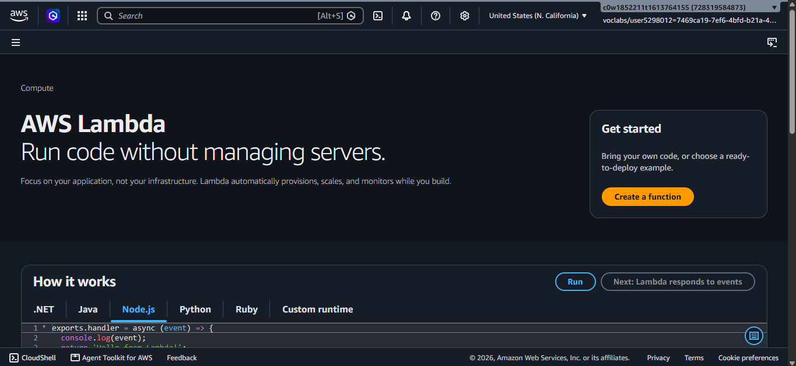
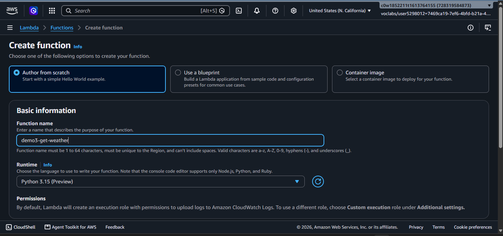
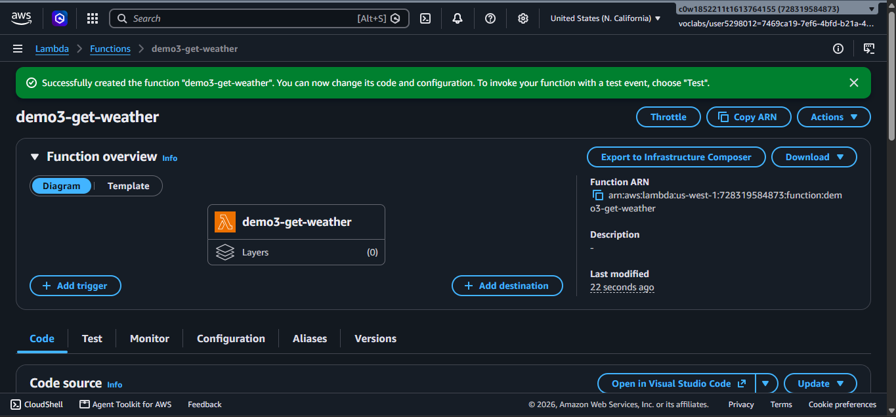
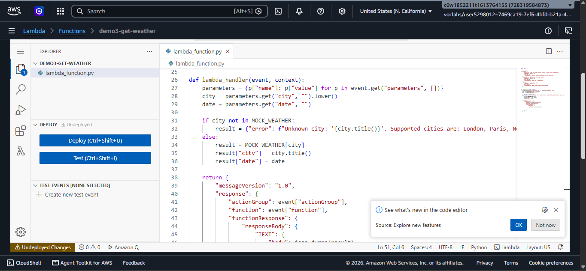
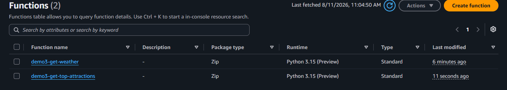
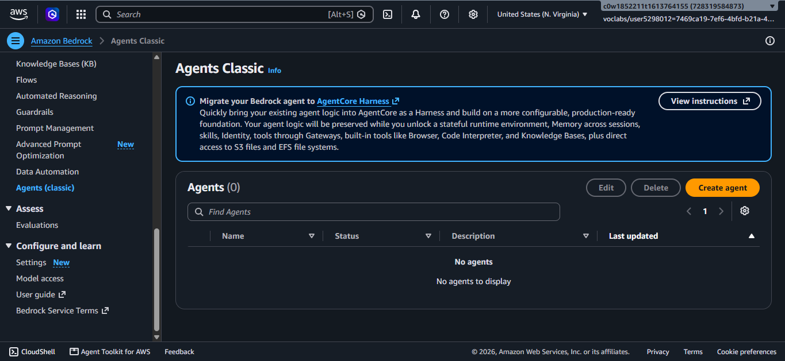
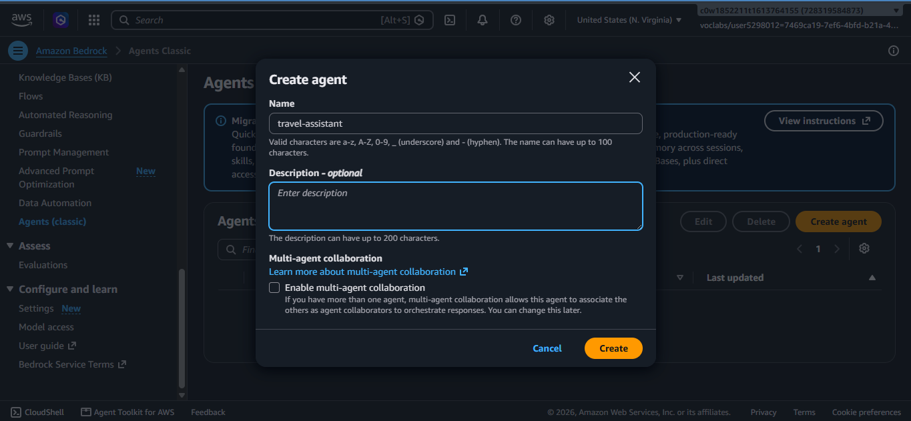
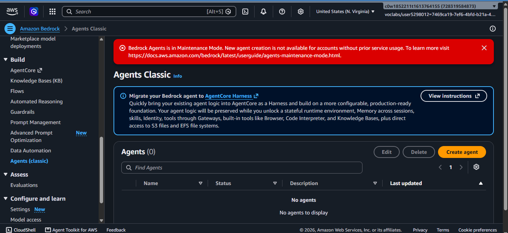

# Demo 3 – Bedrock Agent Prompt

## Setup

### Step 1 – Create the Lambda Functions

The Lambda function code is in the `lambda/` folder. Create two functions in the AWS console:

1. Open the [AWS Lambda console](https://console.aws.amazon.com/lambda) and click **Create function**



2. Choose **Author from scratch**, set runtime to **Python 3.15**


3. Create the first function:
   - Name: `demo3-get-weather`
   - Paste the code from `lambda/get_weather/lambda_function.py`
   - Click **Deploy**
   
   


4. Repeat for the second function:
   - Name: `demo3-get-top-attractions`
   - Paste the code from `lambda/get_top_attractions/lambda_function.py`
   - Click **Deploy**
   

---

### Step 2 – Create the Bedrock Agent

1. Open the [Amazon Bedrock console](https://console.aws.amazon.com/bedrock) and navigate to **Agents**

Note: Bedrock Agents (Agents Classic) is only available in the following regions. Make sure you have set your AWS region to one of these:

us-east-1
us-east-2
us-west-2


2. Click **Create agent**
3. Give the agent a name (e.g. `travel-assistant`)


4. Under **Model**, select **Amazon Nova Pro**
5. Paste the agent instruction below into the **Instructions for the Agent** field
6. Click **Save**

**My account doesn't support Bedrock agents so i'll have to redo the steps using AgentsCore**


---

### Step 3 – Create the Action Groups

Bedrock only allows one Lambda per action group. Create two separate action groups:

**Action Group 1: `get-weather`**

1. Click **Add action group** and name it `get-weather`
2. Under **Action group type**, choose **Define with function details**
3. Add a function named `get_weather` with parameters:
   - `city` (string, required) — the city name
   - `date` (string, required) — the date in YYYY-MM-DD format
4. Under **Action group invocation**, select the `demo3-get-weather` Lambda
5. Click **Save**

**Action Group 2: `get-top-attractions`**

1. Click **Add action group** and name it `get-top-attractions`
2. Under **Action group type**, choose **Define with function details**
3. Add a function named `get_top_attractions` with parameters:
   - `city` (string, required) — the city name
4. Under **Action group invocation**, select the `demo3-get-top-attractions` Lambda
5. Click **Save**

---

### Step 4 – Prepare and Test

1. Click **Save and exit**
2. Click **Prepare** to build the agent
3. Once preparation completes, use the **Test** panel on the right to try the test prompt below

---

## Agent Instruction

```
You are a helpful travel planning assistant. When a user asks for travel recommendations, always use the available tools to gather current weather conditions and top attractions before making any suggestions. Always look up available attractions using a tool call. If the weather is poor, prioritize indoor attractions. Always tailor suggestions to any preferences the user mentions, such as traveling with family or having limited time.
```

---

## Test Prompt

```
I'll be in London this Saturday with my family. What should we do?
```

**Expected:** The agent invokes `get_weather` and `get_top_attractions` before responding. Final answer is grounded in tool results, accounts for weather conditions, and filters for family-friendly options.
