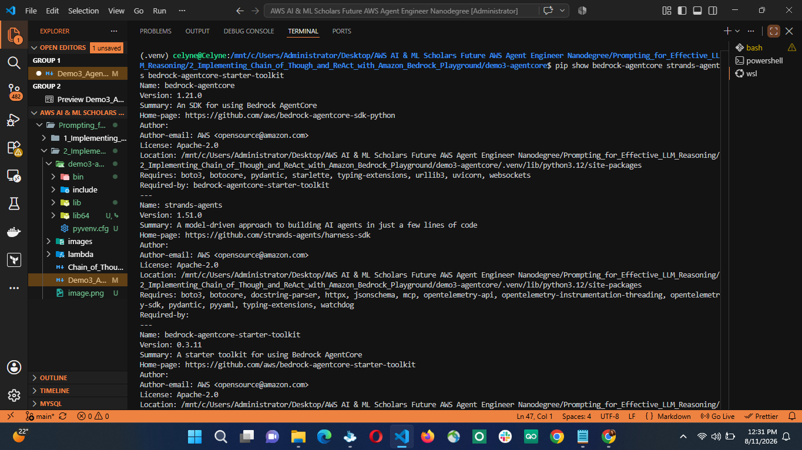
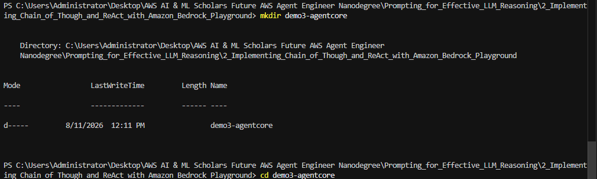
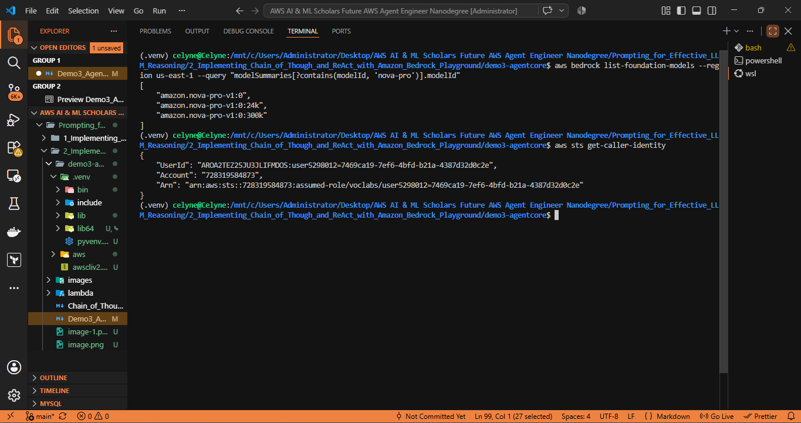
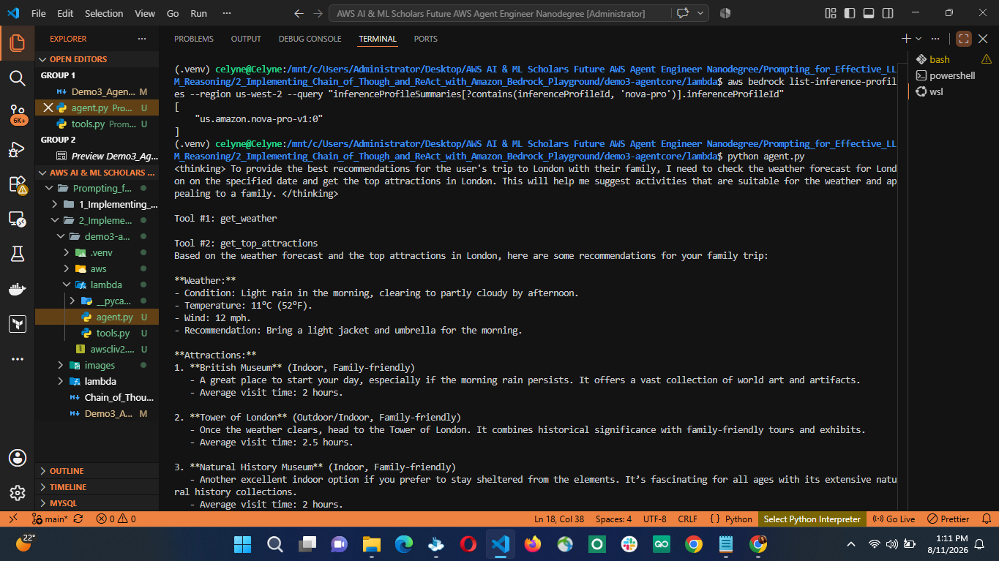
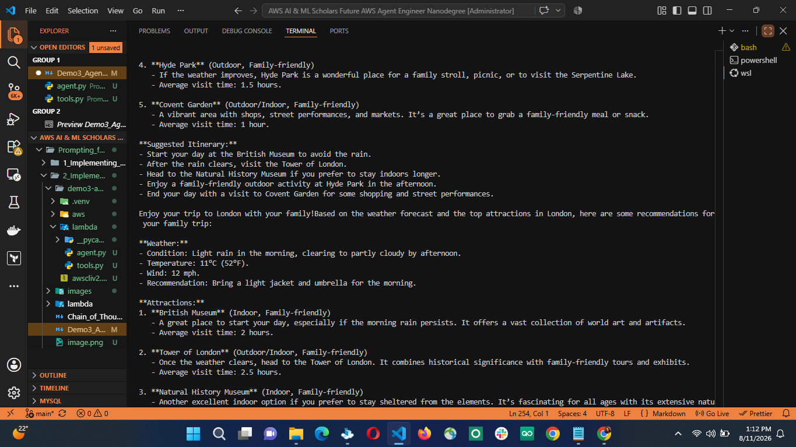
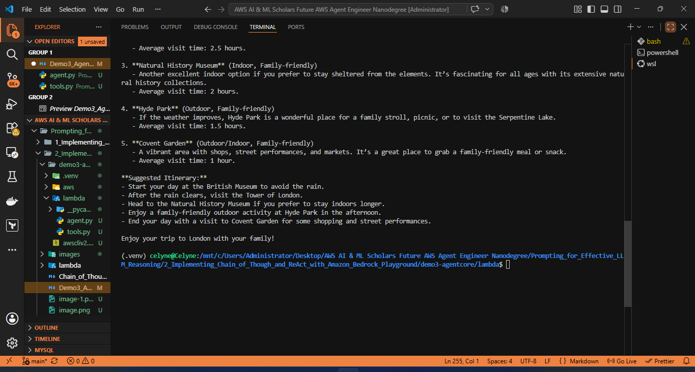

# Demo 3 — Rebuilt for Amazon Bedrock AgentCore

This walks through recreating the original "travel-assistant" exercise using
AgentCore instead of the retired Bedrock Agents console. The core idea:
your two Lambda functions become two Python functions, your agent
instruction becomes a system prompt, and instead of clicking through the
Bedrock Agents console you write ~30 lines of Python.

---

## Concept mapping (old → new)

| Bedrock Agents (old) | AgentCore (new) |
|---|---|
| Agent created in console | `strands.Agent` object in Python |
| "Instructions for the Agent" field | `system_prompt` string |
| Action Group + Lambda function | Python function with `@tool` decorator |
| Amazon Nova Pro (model dropdown) | Model ID passed to `BedrockModel` |
| **Test** panel in console | Run the Python script locally |
| **Prepare** button | Not needed — no separate build step |

---

## Step 1 — Install prerequisites

You need Python 3.10+ and an AWS account with Bedrock model access already
configured (same AWS account you were going to use for Bedrock Agents).

```bash
mkdir demo3-agentcore
cd demo3-agentcore
python3 -m venv .venv
source .venv/bin/activate        # On Windows: .venv\Scripts\activate

pip install --upgrade pip
pip install bedrock-agentcore strands-agents bedrock-agentcore-starter-toolkit boto3
```



**1. Confirm the packages are installed**
```bash
pip show bedrock-agentcore strands-agents bedrock-agentcore-starter-toolkit
```
Each should print a block with `Name`, `Version`, `Location`, etc. If a package isn't found, you'll get `WARNING: Package(s) not found` instead — that means the install didn't complete or you're not in the virtual environment you installed it in.



**2. Confirm Python can actually import them**
```bash
python3 -c "import bedrock_agentcore; import strands; print('OK — bedrock_agentcore', bedrock_agentcore.__version__)"
```
This catches a subtler failure mode: `pip show` can say a package is installed while `import` still fails (wrong virtualenv activated, conflicting Python version, broken install). If this line prints `OK` with a version number, the SDK is genuinely usable.

**3. Confirm the CLI is on your PATH** 
```bash
agentcore --version
```
If you get `command not found`, the CLI installed but isn't on PATH — usually means `pip install` put it in a location your shell doesn't check. Try `python3 -m bedrock_agentcore_starter_toolkit --version` as a fallback, or reactivate your virtual environment (`source .venv/bin/activate`) if you installed inside one and left it.

**4. Sanity-check AWS access separately** (not part of "is AgentCore installed," but worth doing now since it'll block you later)
```bash
aws sts get-caller-identity
```
This confirms your AWS credentials are configured and valid — AgentCore itself will import fine even if this fails, but nothing that touches Bedrock will work until it succeeds.

If you're in a fresh terminal and none of steps 1–3 work, double check you're inside the virtual environment from Step 1 of the guide (`source .venv/bin/activate`) — installing outside it is the most common reason "it worked a minute ago" stops working in a new terminal session.

If AWS credentials are the blocker, and you'll need them before Step 5 (running `agent.py`) will work, since the `BedrockModel` call reaches out to AWS. Here's the fastest path:

**1. Get access keys from AWS**
If you already have an AWS account for this nanodegree, go to the [IAM console](https://console.aws.amazon.com/iam) → your user → **Security credentials** → **Create access key**. Choose "Command Line Interface (CLI)" as the use case. You'll get an **Access Key ID** and a **Secret Access Key** — copy both now, the secret is only shown once.

**2. Install the AWS CLI, if you don't have it**
```bash
aws --version
```
If that fails, install it — on your WSL/Ubuntu setup:
```bash
curl "https://awscli.amazonaws.com/awscli-exe-linux-x86_64.zip" -o "awscliv2.zip"
unzip awscliv2.zip
sudo ./aws/install
```

**3. Configure credentials**
```bash
aws configure
```
It'll prompt for four things:
- `AWS Access Key ID` — paste from Step 1
- `AWS Secret Access Key` — paste from Step 1
- `Default region name` — use whatever region you enabled Bedrock model access in (e.g. `us-east-1`)
- `Default output format` — `json` is fine

This writes to `~/.aws/credentials` and `~/.aws/config`.

**4. Verify it worked**
```bash
aws sts get-caller-identity
```
You should get back a JSON block with your `UserId`, `Account`, and `Arn`. That confirms AWS trusts the credentials.



## Step 2 — Enable model access

In the [Amazon Bedrock console](https://console.aws.amazon.com/bedrock),
go to **Model access** and make sure you have access enabled for the model
you want to use. The original exercise used Amazon Nova Pro — that still
works here. If you'd rather use Claude (most Strands tutorials default to
this), enable a Claude model instead. Either is fine; just note the model
ID, you'll need it in Step 4.

## Step 3 — Turn your two Lambda functions into Python tools

Open `lambda/get_weather/lambda_function.py` and
`lambda/get_top_attractions/lambda_function.py` from your original exercise
files. Copy the logic inside each `lambda_handler` into a plain Python
function, and decorate it with `@tool`. The decorator reads your type hints
and docstring to build the tool definition automatically — no separate
"parameters" configuration screen needed.

Create `tools.py`:

```python
from strands import tool

MOCK_WEATHER = {
    "london": {
        "condition": "Light rain in the morning, clearing to partly cloudy by afternoon",
        "temperature_celsius": 11,
        "wind_mph": 12,
        "recommendation": "Bring a light jacket and umbrella for the morning",
    },
    "paris": {
        "condition": "Mostly sunny with light clouds",
        "temperature_celsius": 14,
        "wind_mph": 8,
        "recommendation": "Great day to be outdoors",
    },
    "new york": {
        "condition": "Clear skies, cold",
        "temperature_celsius": 5,
        "wind_mph": 15,
        "recommendation": "Dress warmly, especially in the wind",
    },
}

MOCK_ATTRACTIONS = {
    "london": [
        {"name": "British Museum", "type": "indoor", "family_friendly": True, "avg_visit_hours": 2},
        {"name": "Tower of London", "type": "outdoor/indoor", "family_friendly": True, "avg_visit_hours": 2.5},
        {"name": "Natural History Museum", "type": "indoor", "family_friendly": True, "avg_visit_hours": 2},
        {"name": "Hyde Park", "type": "outdoor", "family_friendly": True, "avg_visit_hours": 1.5},
        {"name": "Covent Garden", "type": "outdoor/indoor", "family_friendly": True, "avg_visit_hours": 1},
    ],
    "paris": [
        {"name": "Louvre Museum", "type": "indoor", "family_friendly": True, "avg_visit_hours": 3},
        {"name": "Eiffel Tower", "type": "outdoor/indoor", "family_friendly": True, "avg_visit_hours": 2},
        {"name": "Musée d'Orsay", "type": "indoor", "family_friendly": True, "avg_visit_hours": 2},
        {"name": "Luxembourg Gardens", "type": "outdoor", "family_friendly": True, "avg_visit_hours": 1.5},
        {"name": "Notre-Dame Cathedral", "type": "outdoor/indoor", "family_friendly": True, "avg_visit_hours": 1},
    ],
    "new york": [
        {"name": "Central Park", "type": "outdoor", "family_friendly": True, "avg_visit_hours": 2},
        {"name": "American Museum of Natural History", "type": "indoor", "family_friendly": True, "avg_visit_hours": 2.5},
        {"name": "The Metropolitan Museum of Art", "type": "indoor", "family_friendly": True, "avg_visit_hours": 3},
        {"name": "High Line", "type": "outdoor", "family_friendly": True, "avg_visit_hours": 1.5},
        {"name": "Brooklyn Bridge", "type": "outdoor", "family_friendly": True, "avg_visit_hours": 1},
    ],
}


@tool
def get_weather(city: str, date: str) -> dict:
    """Get the weather forecast for a city on a given date.

    Args:
        city: The city name, e.g. "London"
        date: The date in YYYY-MM-DD format
    """
    key = city.lower()
    if key not in MOCK_WEATHER:
        return {"error": f"Unknown city: '{city.title()}'. Supported cities are: London, Paris, New York."}
    result = dict(MOCK_WEATHER[key])  # copy so we don't mutate the shared dict
    result["city"] = city.title()
    result["date"] = date
    return result


@tool
def get_top_attractions(city: str) -> dict:
    """Get the top tourist attractions for a city.

    Args:
        city: The city name, e.g. "London"
    """
    key = city.lower()
    if key not in MOCK_ATTRACTIONS:
        return {"error": f"Unknown city: '{city.title()}'. Supported cities are: London, Paris, New York."}
    return {"city": city.title(), "attractions": MOCK_ATTRACTIONS[key]}
```

**What changed from the Lambda code, and why:**
- Removed the `event`/`context` parameters and the `parameters = {p["name"]: p["value"] for p in event.get("parameters", [])}` line — that was unpacking Bedrock Agents' action-group payload format. A `@tool` function receives its arguments directly as normal Python parameters (`city`, `date`), so that unpacking step is gone.
- Removed the `messageVersion` / `response` / `functionResponse` wrapper — that was the response envelope Bedrock Agents required. A `@tool` function just returns a plain Python dict; Strands handles turning that into whatever the model needs.
- Removed `import json` and `json.dumps(result)` — no longer needed since you're not manually building a JSON string inside a wrapper; you just return the dict.
- Added `dict(MOCK_WEATHER[key])` instead of mutating `MOCK_WEATHER[key]` directly — your original code was fine for a one-shot Lambda invocation, but here the agent runs in a long-lived process, so mutating the shared `MOCK_WEATHER` dict in place would leak `city`/`date` from one call into the next lookup. Copying first avoids that.
- Both your `city.lower()` / `city.title()` logic and your "Unknown city" error message carried over unchanged — that logic wasn't Lambda-specific, so there was nothing to convert.

## Step 4 — Build the agent

Create `agent.py` in the same folder:

```python
from strands import Agent
from strands.models import BedrockModel
from tools import get_weather, get_top_attractions

AGENT_INSTRUCTION = """You are a helpful travel planning assistant. You must
call BOTH the get_weather tool and the get_top_attractions tool for every
travel question before responding — this applies even if you believe you
already know the answer, the weather, or the attractions for a city. Do not
answer from your own knowledge, and do not claim you are unable to provide
weather or attraction information without first attempting to call the
corresponding tool. If a tool call fails or returns an error, say so
explicitly in your response rather than silently omitting that part of the
answer. If the weather is poor, prioritize indoor attractions. Always
tailor suggestions to any preferences the user mentions, such as traveling
with family, traveling with friends, or having limited time."""

model = BedrockModel(
    model_id="amazon.nova-pro-v1:0"  # or your Claude model ID from Step 2
)

agent = Agent(
    model=model,
    system_prompt=AGENT_INSTRUCTION,
    tools=[get_weather, get_top_attractions],
)

if __name__ == "__main__":
    response = agent("I'll be in London this Saturday with my family. What should we do?")
    print(response)
```

## Step 5 — Test locally

```bash
python agent.py
```





**Expected**, same as the original exercise: the agent should call
`get_weather` and `get_top_attractions` before answering, and the final
response should reference the weather and filter toward family-friendly
options. You'll see the tool calls logged in the terminal output as the
agent runs — this is your replacement for the console's **Test** panel.

If it responds without calling the tools, tighten the docstrings on your
`@tool` functions — the model decides whether to call a tool based on the
docstring and parameter descriptions, so vague ones get skipped.

The mock data only covers London, Paris, and New York — testing with any
other city will correctly return the "Unknown city" error from both tools,
which is useful for confirming the agent surfaces tool errors instead of
inventing an answer.

### Test more than one prompt

A single test can pass by coincidence — the model might give a
plausible-sounding answer without actually grounding it in the tool
results. Run at least a few variations and check that the answer visibly
changes with the data, not just the wording:

```python
test_prompts = [
    "I'll be in London on 2026-03-14 with my family. What should we do?",
    "I'll be in Paris on 2026-03-15 with my kids.",
    "I'm in New York for a weekend trip, no kids.",
]
for prompt in test_prompts:
    print(f"\n--- {prompt} ---")
    print(agent(prompt))
```

Since the mock data doesn't vary by date (only by city), you won't see a
rainy-vs-sunny contrast the way you would with date-specific data — but you
should still see the London and Paris answers differ in both weather
framing and attraction picks, since the two cities have different mock
entries. If every answer reads like a generic template regardless of city,
that's a sign the tool results aren't actually influencing the response.

### Debugging tip: watch for skipped tool calls, not just wrong answers

The most common failure mode isn't a crash — it's the model answering
confidently without calling a tool at all. Watch your terminal output for
lines like *"I don't have weather information for that date"* or *"Based on
typical London weather..."* in the final answer. Both are signs a tool call
was skipped rather than attempted and failed. If you see this, it's almost
always the system prompt being too soft rather than a bug in your tool
code — compare your `AGENT_INSTRUCTION` against Step 4 above, which
explicitly forbids answering without calling both tools first.

## Step 6 (optional) — Deploy to AgentCore Runtime

The steps above satisfy "build and test an agent with tools" — the core of
the original exercise. If your assignment also asks you to *deploy* it
(the cloud equivalent of clicking **Save and exit** on a Bedrock Agent),
wrap the agent as an HTTP service and deploy it:

```python
# Add to the bottom of agent.py, replacing the __main__ block:
from bedrock_agentcore.runtime import BedrockAgentCoreApp

app = BedrockAgentCoreApp()

@app.entrypoint
def invoke(payload):
    user_message = payload.get("prompt", "")
    response = agent(user_message)
    return {"result": str(response)}

if __name__ == "__main__":
    app.run()
```

Then deploy with the starter toolkit CLI:

```bash
agentcore configure --entrypoint agent.py
agentcore launch
```

This provisions a serverless AgentCore Runtime and gives you an endpoint
you can invoke the same way you'd have invoked a prepared Bedrock Agent.

**Heads-up:** AWS has been actively changing the AgentCore tooling — as of
mid-2026 there are reports of a newer CDK-based CLI (`@aws/agentcore-cli`)
starting to replace this starter-toolkit CLI in some docs. If
`agentcore configure` or `agentcore launch` doesn't work as shown, check
the current tutorial at
`docs.aws.amazon.com/bedrock-agentcore/latest/devguide/runtime-get-started-toolkit.html`
for the up-to-date command names — the local testing in Steps 1–5 will work
regardless of which CLI version is current.

---

## What you can drop from the original instructions

- Skip the Lambda console entirely (Step 1 of the original doc) — your
  functions now live in `tools.py` and run in-process.
- Skip creating action groups (Step 3 of the original doc) — the `@tool`
  decorator replaces that configuration.
- Skip **Prepare** — there's no separate build step; running the script
  *is* the test.
