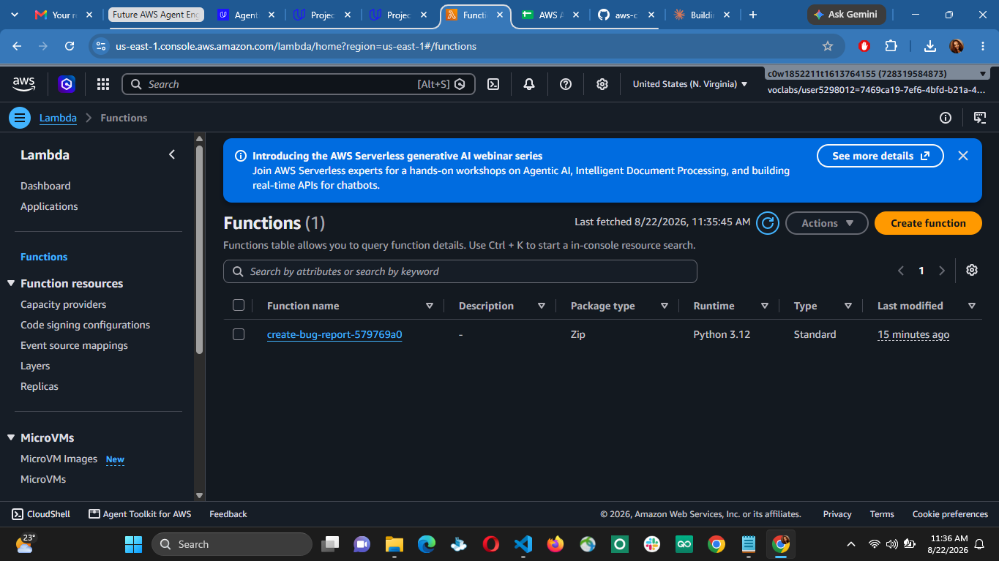
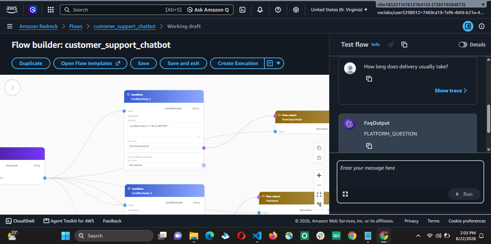
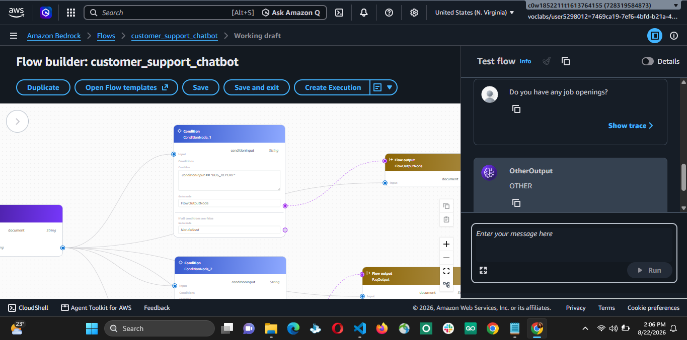

# Solution: Customer Support Chatbot with Amazon Bedrock Flows

## Status
- [ ] Step 0: Environment set up (AWS CLI, credentials, Python deps)
- [ ] Step 1: Tool deployed and tested
- [ ] Step 2: Bedrock Flow built (classification + 3 paths)
- [ ] Step 3: Testing and Evaluation complete

---

## Step 0: Environment Setup

### 0.1 AWS CLI installed and version confirmed

```bash
aws --version
```

Output: 


### 0.2 AWS credentials configured

Method used (check one):
- [ ] `aws configure` (access key / secret key)
- [ ] Vocareum lab-provided credentials (session token required — note expiry)
- [ ] Named profile: `<profile name>`
- [ ] Environment variables (`AWS_ACCESS_KEY_ID`, `AWS_SECRET_ACCESS_KEY`, `AWS_SESSION_TOKEN`)

Verify identity:
```bash
aws sts get-caller-identity
```

Output: 

**Note:** if using a Vocareum-style lab account, session tokens expire — document how long the session lasts and the refresh step, since a mid-project expiry will silently break `aws cloudformation deploy` calls with a credentials error that looks unrelated to the actual template.

### 0.3 Region set

```bash
aws configure get region
```

Confirm it prints `us-east-1`, or pass `--region us-east-1` explicitly on every command.


### 0.4 Bedrock model access enabled

**Console region check:** the AWS Console has its own region selector (top-right), independent of aws configure. Confirm it reads US East (N. Virginia) before doing anything in the Bedrock/Lambda/DynamoDB consoles — a mismatch here means console actions land in the wrong region even after the CLI default is fixed.

![Amazon Bedrock Model access page in the AWS management console, shown in a dark interface. The left sidebar lists Amazon Bedrock, Discover, Labs, Test, and Infer. The main panel shows the heading Model access and the text Model access page has been retired. The body explains that serverless foundation models are now automatically enabled and that no manual activation is needed. A right-side panel lists regions, with United States, N. Virginia and us-east-1 selected. A note says AWS Marketplace permissions must be configured and that users can access models through the InvokeModel API or Converse. The browser chrome and AWS console header are visible in the wider environment, which is a dark, technical workspace. The tone is neutral and instructional.](image-3.png)

**Model access:** AWS retired the manual Model access page — foundation models (including Amazon Nova Pro) are now auto-enabled account-wide on first invocation, no activation step needed. 

Confirm access works by invoking the model once (Bedrock Playground, us-east-1) rather than checking a settings page.

![Amazon Bedrock Playground page in the AWS Management Console, displayed in a dark navy interface. The left sidebar includes Discover, Labs, Test, and Infer. In the main panel, the model selector shows Nova Pro, the mode is Chat, and the chat window contains the user message Hello, confirm you are working. The assistant response reads Hello! I am here and functioning as expected. How can I assist you today? If you have a question, need information, or require help with a task, feel free to ask! The wider environment is a browser window on a desktop with a dark coding workspace visible behind it. The overall tone is neutral and technical.](image-4.png)

### 0.5 Python environment and dependencies

```bash
python3 --version
python3 -m venv venv
source venv/bin/activate      # Windows: venv\Scripts\activate
pip install -r requirements.txt
```

![Dark terminal window in a developer workspace showing the Python virtual environment setup steps. The command python3 --version is entered first, returning Python 3.12.3. Next, python3 -m venv venv is run, followed by source venv/bin/activate, and then pip install -r requirements.txt. The terminal uses a dark theme with blue command text on a black background, while the surrounding workspace remains minimally visible in a neutral coding environment. The overall tone is instructional and technical.](image-5.png)

Verify boto3:
```bash
python -c "import boto3; print(boto3.__version__)"
```

Output: 

---

## Step 1: Tool Deployment (DynamoDB + Lambda)

### 1.1 Deploy `cloudformation-tool.yaml`

Command run:
```bash
aws cloudformation deploy \
    --template-file cloudformation-tool.yaml \
    --stack-name bug-report-tool-stack \
    --capabilities CAPABILITY_NAMED_IAM \
    --region us-east-1
```

**Result:** 

Stack outputs (`BugReportsTableArn`, `LambdaFunctionArn`, `LambdaExecutionRoleArn`):

```
BugReportsTableArn      = arn:aws:dynamodb:us-east-1:728319584873:table/BugReports-579769a0
LambdaFunctionArn       = arn:aws:lambda:us-east-1:728319584873:function:create-bug-report-579769a0
LambdaExecutionRoleArn  = arn:aws:iam::728319584873:role/create-bug-report-role-579769a0
```


![VS Code terminal displaying the AWS CloudFormation stack outputs for bug-report-tool-stack. The command aws cloudformation describe-stacks queries the stack in us-east-1 and formats the results as a table. The table lists BugReportsTableArn with value arn:aws:dynamodb:us-east-1:728319584873:table/BugReports-579769a0, LambdaExecutionRoleArn with value arn:aws:iam::728319584873:role/create-bug-report-role-579769a0, and LambdaFunctionArn with value arn:aws:lambda:us-east-1:728319584873:function:create-bug-report-579769a0. A shell prompt is visible below the successful output in a dark, technical development environment.](image-8.png)

### 1.2 Test Lambda function in isolation

Test event used: sample JSON from Project-Instructions.md (checkout crash example).




![AWS Lambda Test event panel for create-bug-report-579769a0. The main focus is the test event configuration form in the AWS Lambda console. The panel shows a dark interface with a blue highlighted Create new event tab, a Synchronnous invocation type selected, event name field with the placeholder MyEventName, and a Private event sharing setting. At the top of the window, the Lambda function name create-bug-report-579769a0 is visible in the header, and a dark AWS navigation bar and browser chrome frame the page. The overall tone is technical and successful, with a clean development environment. Text visible in the image includes AWS Lambda, create-bug-report-579769a0, Test event, Invoke your function without saving an event, Create new event, Edit saved event, Synchronous, Event name, MyEventName, Private, and CloudShell, Agent Toolkit for AWS, Feedback.](image-12.png)


![AWS CloudWatch Log Management showing the Lambda function log group /aws/lambda/create-bug-report-579769a0. The dark AWS console displays log group details including the ARN arn:aws:logs:us-east-1:728319584873:log-group:/aws/lambda/create-bug-report-579769a0:*, Standard log class, retention Never expire, and region United States N Virginia. Navigation links include CloudWatch, Log management, Ingestion, Dashboards, Alarms, AI Operations, GenAI Observability, Application Signals APM, Infrastructure Monitoring, and Logs. The page is a technical monitoring environment with a clear, successful deployment-focused tone.](image-14.png)

Ticket ID returned: `5f81bbeb-2fa4-4f4c-b8fb-9b080e86ff16`

### 1.3 Verify DynamoDB record


![Amazon DynamoDB table settings page for BugReports-579769a0 in the AWS Management Console. The table is Active and has ticketId as its String partition key, no sort key, on-demand capacity, zero items, and zero bytes. Point-in-time recovery and resource-based policy are not active, and there are no active alarms. The page displays the table ARN arn:aws:dynamodb:us-east-1:728319584873:table/BugReports-579769a0. Visible navigation includes DynamoDB, Tables, Settings, Indexes, Monitor, Global tables, Backups, Exports and streams, Permissions, Actions, and Explore table items. The dark console provides a technical table-verification environment.](image-16.png)

![Amazon DynamoDB console showing the BugReports-579769a0 table with a Get live item count dialog open. The dialog reports an item count of 1, scan status Complete, and last updated August 22, 2026 11:46:02, with Scan again and Cancel buttons. It warns that scanning can consume additional read capacity and is not recommended for very large or critical production tables. Behind the dialog, the table status is Active and the Amazon Resource Name is arn:aws:dynamodb:us-east-1:728319584873:table/BugReports-579769a0. The dark AWS Management Console is open in the United States N Virginia region, creating a technical and successful verification environment.](image-17.png)

![Amazon DynamoDB Explore items page displaying one returned item from the BugReports-579769a0 table. The AWS Management Console shows a completed scan with Items returned: 1, Items scanned: 1, Efficiency: 100%, and RCUs consumed: 2. The results table includes ticketId, createdAt, description, environment, status, and stepsToReproduce columns; the single record begins with ticket ID 5f81bbeb-2fa4-4f4c-..., has status OPEN, and contains checkout-related bug details. The dark AWS console is open in the United States N Virginia region, providing a technical and successful verification environment.](image-18.png)

![Amazon DynamoDB Edit item page for the BugReports-579769a0 table, showing the single bug report record in a dark AWS Management Console. The form displays ticketId 5f81bbeb-2fa4-4f4c-b8fb-9b080e86ff16, createdAt 2026-08-22T08:39:54.856325+00:00, description The checkout page crashes when I click the Pay button, environment Chrome 120 on macOS Sonoma, status OPEN, and stepsToReproduce 1. Add an item to the cart. 2. Go to checkout. 3. Click Pay. Visible interface text includes Edit item, Attributes, Attribute name, Value, Type, Remove, Add new attribute, Form, JSON view, DynamoDB, Explore items: BugReports-579769a0, and CloudShell. The technical interface presents a clear, successful record-verification environment.](image-19.png)

```
{
  "ticketId": {
    "S": "5f81bbeb-2fa4-4f4c-b8fb-9b080e86ff16"
  },
  "createdAt": {
    "S": "2026-08-22T08:39:54.856325+00:00"
  },
  "description": {
    "S": "The checkout page crashes when I click the Pay button"
  },
  "environment": {
    "S": "Chrome 120 on macOS Sonoma"
  },
  "status": {
    "S": "OPEN"
  },
  "stepsToReproduce": {
    "S": "1. Add an item to the cart. 2. Go to checkout. 3. Click Pay."
  }
}
```

---

## Step 2: Bedrock Flow

### 2.1 Classification design

Labels used: `BUG_REPORT | PLATFORM_QUESTION | OTHER`

Classifier prompt:
```
You are a message classifier for a customer support chatbot. Classify the customer's message into exactly one of these three categories:

BUG_REPORT - the customer is reporting something broken, malfunctioning, or not working as expected on the website or app.
PLATFORM_QUESTION - the customer is asking about orders, shipping, delivery, returns, refunds, payments, products, or their account.
OTHER - the message doesn't fit either category above (general inquiries, unrelated topics, complaints not about a bug, etc).

Respond with ONLY the category label and nothing else. No punctuation, no explanation, no extra words.

Customer message: {{input}}
```

Rationale for label choice / prompt structure:
- Short, all-caps, single-token-ish labels minimize the chance of the model appending punctuation, casing variation, or extra words that would break the Condition node's exact-string matching.
- The prompt explicitly forbids anything except the bare label to reduce prose leakage into the classifier output.
- Open question / edge case: messages that are complaints but not bugs (e.g. "my refund is taking too long") currently fall under OTHER and get redirected to phone support rather than answered from the FAQ. 

#### 2.1.1 Build steps

1. Bedrock console → Flows → Create flow (region: us-east-1 — confirm region selector before starting)


![Amazon Bedrock Flow builder for customer_support_chatbot in the AWS Management Console. The dark-themed interface shows the United States N. Virginia region and a blank flow canvas. The left Flow builder panel has Nodes selected and lists Collector, Condition, DoWhile Loop, and Iterator under Logic. The top toolbar includes Duplicate, Open Flow templates, Save, Save and exit, and Create Execution. On the right, the Test flow panel contains an empty message field with a Run button. The uncluttered workspace has a focused, task-oriented tone.](image-22.png)

2. Add an Input node. Input node name: `FlowInputNode`
![Amazon Bedrock Flow builder showing a blank customer support chatbot canvas with a Flow Input node connected to a Prompts node and a Flow output node. The left configuration panel is open for the Flow Input node and shows the node name FlowInputNode and output name document. The top toolbar includes Duplicate, Open Flow templates, Save, Save and exit, and Create Execution. On the right, the Test flow panel contains an empty message field and a Run button. The dark AWS Management Console interface is open in the United States N. Virginia region and presents a focused workspace for configuring and testing the flow.](image-23.png)


3. Add a Prompt node after the Input node. Model: Amazon Nova Pro. Paste the classifier prompt above, wire `{{document}}` to the Input node's output.
![Amazon Bedrock Flow builder showing the Prompts node configuration for a customer support chatbot. The canvas contains a Flow input node connected to Prompt_1 and a Flow output node. The Configure panel identifies the node as Prompts, shows the node name Prompt_1, and offers options to use a prompt from Prompt Management or define one in the node. The AWS console is open to the customer_support_chatbot working draft in the United States N. Virginia region, with the Test flow panel and Run button visible on the right. The focused dark-themed interface presents a clean workspace for configuring and testing the flow.](image-24.png)

![Amazon Bedrock Flow builder showing the customer_support_chatbot working draft in the United States N. Virginia region. A blank flow canvas contains a Flow input node connected to a Prompts node labeled Prompt_1 and a Flow output node. The left configuration panel shows the selected Nova Pro 1.0 On-demand model, an optional Guardrail selector, and a classifier prompt beginning You are a message classifier for a customer support chatbot. The right Test flow panel has an empty Enter your message here field and a Run button. The dark AWS Management Console interface presents a focused workspace for configuring and testing the prompt flow.](image-25.png)


4. Add a Condition node after the Prompt node. Define three exact-match conditions, one per label (`BUG_REPORT`, `PLATFORM_QUESTION`, `OTHER`).

Right panel, "Enter your message here" box: type a clean bug report, e.g.

```
The checkout page crashes when I click Pay.
```

Click **Run**. Look at the output — it should show `modelCompletion: BUG_REPORT` with nothing else attached (no period, no quotes, no "Category: " prefix).


Then run two more, one at a time, checking output each time:

```
How long does delivery usually take?
```
→ expect exactly `PLATFORM_QUESTION`

![Amazon Bedrock Flow builder test screen showing the customer message How long does delivery usually take? and a FlowOutputNode result of PLATFORM_QUESTION. The expanded Output trace displays JSON containing the submitted document, the next Prompt_1 node, the document output type STRING, FlowInputNode, and a timestamp. The dark AWS Management Console workspace also shows the empty Enter your message here field and Run button. The focused interface documents a successful platform-question classification test.](image-28.png)

```
Do you have any job openings?
```
→ expect exactly `OTHER`


### 2.1.2 Wiring the Condition node

1. In the flow canvas, delete the direct wire from Prompt_1's `modelCompletion` output straight into FlowOutputNode's input — you're about to insert a Condition node between them.


2. From the Nodes panel (left, where "Nodes | Configure" tabs live), drag a Condition node onto the canvas.
![Amazon Bedrock Flow builder showing a Condition node named ConditionNode_1 on a dotted-grid canvas below a Prompts node named Prompt_1. The Condition node contains the labels Input, conditionInput, String, Conditions, Condition, No condition set, Go to node, Not defined, If all conditions are false, and Go to node. Prompt_1 shows document, String, and modelCompletion, and a Flow output node named FlowOutputNode is positioned to the right. The left Nodes panel lists Collector, Condition, DoWhile Loop, and Iterator. The right Test flow panel shows a FlowOutputNode result of OTHER, an Enter your message here field, and a Run button. The dark AWS Management Console workspace has a focused, task-oriented interface for configuring conditional routing.](image-32.png)


3. Wire Prompt_1's `modelCompletion` output → Condition node's input.
![Amazon Bedrock Flow builder canvas showing a Flow input node connected to a Prompts node named Prompt_1, whose modelCompletion output connects to a Condition node named ConditionNode_1. Visible labels include Output, document, String, Input, modelCompletion, conditionInput, Conditions, Condition, No condition set, Go to node, and Not defined. The Condition node also shows If all conditions are false and a second Go to node field set to Not defined. The nodes are arranged on a light dotted-grid workspace for configuring conditional routing.](image-33.png)


4. In the Condition node's Configure tab, add three conditions, each an exact-match expression against the input, one per label:
   - Condition 1: input equals `BUG_REPORT`
   - Condition 2: input equals `PLATFORM_QUESTION`
   - Condition 3: input equals `OTHER` (or use the Condition node's default/else branch for this one, if it has one — check what the UI offers)
![Amazon Bedrock Flow builder canvas showing Prompt_1 connected to ConditionNode_1, which routes the prompt output to FlowOutputNode. The Condition node displays the expression $.conditionInput == BUG_REPORT, the Go to node field set to FlowOutputNode, and If all conditions are false set to Not defined. Visible labels include Flow input, Output, document, String, Prompts, modelCompletion, conditionInput, Conditions, and Flow output. The nodes are arranged on a light dotted-grid workspace with zoom and canvas controls along the right side.](image-34.png)

![Amazon Bedrock Flow Builder canvas showing two Condition nodes routing classification results. ConditionNode_2 contains the expression $.conditionInput == PLATFORM_QUESTION and routes to FaqOutput. ConditionNode_3 contains the expression $.conditionInput == OTHER and routes to OtherOutput. Each node displays conditionInput, String, Conditions, Condition, Go to node, and If all conditions are false fields. Partial output nodes are visible on the right, including FaqOutput and OtherOutput. The nodes are arranged side by side on a light dotted-grid workspace in a technical workflow editor.](image-35.png)


5. You'll now need three separate Output nodes (not the single existing FlowOutputNode) — per the project's own tip: "A single Output node can't receive connections from multiple branches." Rename or duplicate FlowOutputNode into three, e.g. `BugReportOutput`, `FaqOutput`, `OtherOutput`.


![Amazon Bedrock Flow Builder canvas showing Prompt_1 connected to two Condition nodes that route classified requests to separate outputs. The upper ConditionNode_2 displays the expression $.conditionInput == PLATFORM_QUESTION and routes to FaqOutput. The lower ConditionNode_3 displays the expression $.conditionInput == OTHER and routes to OtherOutput. Visible node text includes Flow input, Prompts, Prompt_1, modelCompletion, Condition, conditionInput, Conditions, Go to node, FaqOutput, OtherOutput, and Flow output. The nodes are arranged on a light dotted-grid workflow canvas in a focused technical configuration environment.](image-38.png)

6. Wire each Condition branch to its own temporary Output node.

![AWS Amazon Bedrock Flow Builder displays the saved customer_support_chatbot working draft. On the dotted workflow canvas, Flow input connects to Prompts Prompt_1, whose modelCompletion output connects to parallel Condition nodes ConditionNode_2 and ConditionNode_3. ConditionNode_2 shows conditionInput == PLATFORM_QUESTION and routes to the Flow output FaqOutput. ConditionNode_3 shows conditionInput == OTHER and routes to OtherOutput. The green banner reads Changes to customer_support_chatbot successfully saved. The AWS console interface has a focused technical configuration tone.](image-39.png)

7. Test all three messages again once wired, confirming each lands at the correct Output node this time — not just the correct label.

In "Enter your message here," type a clear bug report, e.g. `The checkout page crashes when I click Pay.`
Click Run.
In the response, check the node name shown above the output — it should say FlowOutputNode (that's the BUG_REPORT destination), with BUG_REPORT as the value.


`How long does delivery usually take?` — response should come from FaqOutput, value PLATFORM_QUESTION.




`Do you have any job openings?` — response should come from OtherOutput, value OTHER.




### Notes / issues encountered — 2.1

- The three Condition nodes (ConditionNode_1/2/3) are wired in parallel, each fed independently from Prompt_1's modelCompletion output, rather than chained. Each has an exact-match condition for one label (BUG_REPORT, PLATFORM_QUESTION, OTHER) routing to its own Output node.
- Known limitation: none of the three "If all conditions are false" branches are wired to a fallback. If the classifier ever returns output that doesn't exactly match one of the three defined labels (whitespace, casing, extra text), the flow has no defined path and will likely fail rather than degrade to a redirect. Attempted to wire each false-branch to OtherOutput as a defensive catch-all; connections did not take in the console (possibly because Output node inputs don't support multiple incoming wires — unconfirmed). Left unresolved for now.
- Mitigation in place instead: the classifier prompt was tested in isolation across all three categories and returned clean, exact-match output with no stray characters each time (see 2.1.1). Eval testing in Step 3 should be checked for any FLOW_ERROR entries that might indicate this edge case firing in practice.


### 2.2 Bug Report path (Agent node) — ⚠️ SUPERSEDED, see "Revised Step 2" below

![A dark VS Code terminal shows an AWS CLI attempt to create a Bedrock agent named bug-report-agent in the us-east-1 region, using foundation model amazon.nova-pro-v1:0 and an agent resource role ARN. The command fails with an AccessDeniedException stating that Bedrock Agents is in Maintenance Mode and new agent creation is unavailable for accounts without prior service usage. The terminal displays the AWS documentation URL for more information and returns to the shell prompt, conveying a technical setup error.](image-47.png)


Action group / Lambda linkage: [work stopped here]

While building this section, hit a hard blocker: Bedrock Agents Classic is in Maintenance Mode and blocks new agent creation for accounts without prior service usage. Screenshot and full incident log below.

Console error: "Bedrock Agents is in Maintenance Mode. New agent creation is not available for accounts without prior service usage."

![Amazon Bedrock Agents Classic console in a dark AWS web interface showing zero agents and a prominent red maintenance warning. The warning reads Bedrock Agents is in Maintenance Mode. New agent creation is not available for accounts without prior service usage and links to AWS documentation. A blue notice says Agents Classic will no longer be open to new customers starting July 30, 2026 and recommends Amazon Bedrock AgentCore. The page also offers a Try AgentCore button and displays an empty agents list with a Create agent button, conveying a technical setup blocker.](image-48.png)

Confirmed via CLI as well (not just a console-only restriction):
```
aws bedrock-agent create-agent --agent-name bug-report-agent --agent-resource-role-arn <role-arn> --foundation-model amazon.nova-pro-v1:0 --region us-east-1
```
Returned: `AccessDeniedException: Bedrock Agents is in Maintenance Mode. New agent creation is not available for accounts without prior service usage.`

Per AWS: Bedrock Agents Classic (launched Nov 2023) closed to new customers as of July 30, 2026. Successor is Amazon Bedrock AgentCore.

Confirmed AgentCore is the expected approach for this project going forward.

---

## Revised Step 2 — Pivoting to AgentCore Managed Harness

This project originally called for a Bedrock Flow with a classifier prompt, Condition node routing, and a Bedrock Agent node for the bug-report path (see 2.1 and 2.2 above). After hitting the Agents Classic maintenance-mode block, the architecture changes as follows:

- **No Bedrock Flow.** Routing between bug reports, platform questions, and other requests now lives entirely inside a single system prompt (`system_prompt.txt`), not a Flow with Condition nodes.
- **No Agent node.** The bug-report path is handled by the AgentCore managed harness directly, with tool access via an AgentCore Gateway wrapping the existing `create_bug_report` Lambda.
- **New required files:** `system_prompt.txt`, `setup_gateway.py`, `create_harness.py`, `chat.py`, `harness-tests.json`, `cleanup_agentcore.py`.
- **Updated `cloudformation-tool.yaml`:** fixed resource names (`bug-report-tool-stack-*`) plus new IAM roles for the Gateway and the Harness, since the original suffix-named template had neither.

The classifier prompt design and testing discipline from 2.1 (exact-match output, isolate-before-integrate) carry over conceptually into how the new system prompt's routing instructions are written and tested — see below.

### 2.2.1 Redeploy the tool stack

1. **Delete the old stack first.** The new template uses fixed resource names instead of the old suffix-based ones.

```bash
aws cloudformation delete-stack --stack-name bug-report-tool-stack --region us-east-1
```


Wait for it to finish:
```bash
aws cloudformation wait stack-delete-complete --stack-name bug-report-tool-stack --region us-east-1
```
(This may take a minute or two — the command just blocks until done, no output until it returns.)


2. **Move the new template into my project folder**, replacing the old `cloudformation-tool.yaml` in my `starter/`.

3. **Deploy the new template:**
```bash
aws cloudformation deploy \
  --template-file cloudformation-tool.yaml \
  --stack-name bug-report-tool-stack \
  --capabilities CAPABILITY_NAMED_IAM \
  --region us-east-1
```
![VS Code integrated terminal showing the AWS CloudFormation deployment command completing successfully. The terminal displays aws cloudformation deploy with template-file cloudformation-tool.yaml, stack-name bug-report-tool-stack, capabilities CAPABILITY_NAMED_IAM, and region us-east-1, followed by Waiting for changeset to be created, Waiting for stack create/update to complete, and Successfully created/updated stack - bug-report-tool-stack. The dark-themed terminal is open in the project directory with the virtual environment active, and the returned shell prompt indicates a successful, error-free deployment.](image-51.png)


4. **Get the new outputs** — this time we'll see four ARNs instead of three (Lambda, Lambda role, Gateway role, Harness role), plus the DynamoDB table name is now fixed, not suffixed:
```bash
aws cloudformation describe-stacks \
  --stack-name bug-report-tool-stack \
  --query 'Stacks[0].Outputs' \
  --output table \
  --region us-east-1
```

![VS Code integrated terminal in a dark-themed window showing the AWS CloudFormation describe-stacks command for bug-report-tool-stack in us-east-1. The command queries Stacks[0].Outputs and displays a table with five outputs: LambdaExecutionRoleArn, LambdaFunctionArn, GatewayRoleArn, HarnessRoleArn, and BugReportsTableName. The visible descriptions identify the Lambda execution role, create-bug-report Lambda function, AgentCore Gateway role, AgentCore managed harness role, and BugReports DynamoDB table; the table value begins bug-report-tool-stack-bug-reports. The shell prompt has returned in the Solution project directory, indicating the command completed successfully.](image-53.png)

![AWS Lambda console Code source view for the bug-report-tool-stack-create-bug-report function. The dark-themed browser displays the index.py file, with visible Python code importing json, os, uuid, datetime and boto3, creating a DynamoDB table resource from the TABLE_NAME environment variable, and defining a lambda_handler function. Comments explain that AgentCore Gateway sends tool arguments directly as a plain JSON object. The left sidebar shows the function explorer, Deploy and Test buttons, and an option to create a test event; the AWS navigation bar and Windows taskbar are visible around the focused development workspace.](image-54.png)


### 2.2.2 Test the Lambda in isolation (new unwrapped event format)

The AgentCore Gateway sends tool arguments directly as the Lambda event — a plain JSON object, no messageVersion/parameters wrapper like Agents Classic used. The Lambda code was updated accordingly, so it needs to be re-tested with the new event shape before moving on.

Steps:
1. Region check first — confirm the console still reads US East (N. Virginia).
2. Lambda console → search **bug-report-tool-stack-create-bug-report** → open it.
3. Click the **Test** tab.


4. Click **Create new event** (or "New event").
5. Name it, e.g. `bug-report-test-agentcore`.
6. Paste the event JSON (no wrapper this time):

```json
{
    "description": "The checkout page crashes when I click the Pay button",
    "stepsToReproduce": "1. Add an item to the cart. 2. Go to checkout. 3. Click Pay.",
    "environment": "Chrome 120 on macOS Sonoma"
}
```

7. Click **Save**, then click **Test**.
8. Confirm the response is a clean, unwrapped JSON object — no messageVersion/response envelope this time:

```json
{
  "ticketId": "9572f7c0-5f12-410b-8ba8-6f04eae8a774",
  "status": "OPEN"
}
```

![AWS Lambda test results showing a successful execution of the bug-report-tool-stack-create-bug-report function. The dark AWS Console displays a green Executing function: succeeded status and a Response panel containing JSON with ticketId 9572f7c0-5f12-410b-8ba8-6f04eae8a774 and status OPEN. Execution details show function version LATEST, duration 295.46 ms, billed duration 797 ms, and 128 MB configured with 94 MB used. The surrounding Lambda interface includes navigation, logs, Format JSON, CloudShell, Agent Toolkit for AWS, and AWS footer controls.](image-56.png)

### 2.2.3 Verify the DynamoDB record

1. DynamoDB console → Tables → **bug-report-tool-stack-bug-reports** → **Explore table items**.

![AWS Management Console DynamoDB Tables page with the bug-report-tool-stack-bug-reports table selected in the left navigation. The main panel shows the dark blue AWS interface with the heading DynamoDB, the tables list, and a highlighted table row for bug-report-tool-stack-bug-reports with Status Active, Partition key ticketId, and the table name in blue. Top navigation includes Search, Actions, Delete, and Create table controls, and the footer bar includes CloudShell and Agent Toolkit for AWS. The overall tone is professional and functional. Text visible includes DynamoDB, Tables (1), bug-report-tool-stack-bug-reports, Active, ticketId, Actions, Delete, and Create table.](image-57.png)

2. Confirm an item exists with `ticketId` matching the value returned by the Lambda test above.

![AWS DynamoDB console showing the bug-report-tool-stack-bug-reports table details page. The left sidebar lists one table named bug-report-tool-stack-bug-reports with Active status and a partition key of ticketId. In the main panel, the heading General information appears with Item count 0, Point-in-time recovery Off, and a blue Get live item count button near the upper right. The interface is dark blue and professional, with text visible including DynamoDB, Tables, bug-report-tool-stack-bug-reports, General information, Item count, and Get live item count.](image-58.png)

3. If the item count shows 0 immediately after the test, use **Get live item count** to force a fresh scan rather than trusting the cached count (this happened before — it was a display lag, not a real failure).

![AWS DynamoDB console showing a Get live item count dialog for the bug-report-tool-stack-bug-reports table. The dialog explains that choosing Start scan performs a DynamoDB scan and may consume additional read capacity units, with a yellow warning that the action is not recommended for very large or critical-production tables. The results show Item count 1, Scan status Complete, and Last updated August 22, 2026 17:03:03. The dialog has Scan again and Cancel buttons. Behind it, the dark AWS console shows the selected table, the Explore table items button, and table status Active.](image-59.png)


No — those are two different sections of the doc entirely, and I should have been clearer about that. What I gave you last was only the **Step 3 (Testing)** rewrite. The `setup_gateway.py` work belongs under **Revised Step 2**, as its own subsection — 2.2.4, coming right after 2.2.3 (DynamoDB verification) which you already completed.

Here's that piece, to insert between 2.2.3 and the Step 3 block I gave you:


### 2.2.4 Create the AgentCore Gateway (setup_gateway.py)

`setup_gateway.py` reads the bug-report-tool-stack CloudFormation outputs directly (no copy-pasting), creates a Cognito OAuth authorizer, creates the AgentCore Gateway, and registers the create-bug-report Lambda as a tool target named `bugreports` — so the model will see it as the tool `bugreports___create_bug_report`. Config is saved to `agentcore_config.json` for the next steps to read.

Pre-flight checks before running:
```bash
pip show bedrock-agentcore-starter-toolkit
python -c "from bedrock_agentcore_starter_toolkit.operations.gateway.client import GatewayClient; help(GatewayClient.create_mcp_gateway_target)"
```
Compare the printed signature against what the script assumes, and add `bedrock-agentcore-starter-toolkit` to `requirements.txt` if missing before running `pip install -r requirements.txt`.

![VS Code terminal showing pre-flight checks for the AgentCore Gateway setup. The terminal displays pip show bedrock-agentcore-starter-toolkit with version 0.3.12 installed, followed by a help command for GatewayClient.create_mcp_gateway_target that is stopped before producing output. The prompt is ready for the next command. The surrounding dark-themed VS Code window shows the Solution project files in the Explorer, including requirements.txt and gateway-related scripts. The scene is informational and task-focused.](image-60.png)

Run:
```bash
python setup_gateway.py
```

Expected output: gateway ID, gateway URL, target ID printed to console, and `agentcore_config.json` written to disk.

![VS Code terminal showing a failed run of python setup_gateway.py in the Solution project. The terminal reports that the script is reading outputs from stack bug-report-tool-stack and then fails with an AccessDenied error because the assumed role is not authorized to perform cloudformation:DescribeStacks on the bug-report-tool-stack resource. The dark VS Code window includes the project Explorer and an idle shell prompt after the traceback. Visible text includes python setup_gateway.py, Reading outputs from stack: bug-report-tool-stack, Traceback, AccessDenied, DescribeStacks, and the project path. The tone is diagnostic and task-focused.](image-61.png)


![VS Code terminal in a dark theme showing a successful AgentCore Gateway setup for the bug-report project. The command python setup_gateway.py is running, and the output lists reading CloudFormation outputs from the bug-report-tool-stack stack, creating a Cognito OAuth authorizer, creating the gateway, and reporting the gateway URL. The terminal then shows the gateway ready message and the final values for the gateway ID and target ID, with the project Explorer visible in the background. The tone is technical, task-focused, and successful. Text visible includes python setup_gateway.py, bug-report-tool-stack, Gateway, URL, Gateway ID, and Target ID.](image-63.png)


```
Gateway ID: bug-report-gateway-jtm5mmaxes
Target ID: LTIUU4FISI
Tool will appear to the model as: bugreports___create_bug_report
```
### 2.2.5 Create the harness and update system_prompt.txt binding

`create_harness.py` reads `system_prompt.txt`, substitutes the `{{FAQ}}` placeholder with `online_shop_faq.md`'s contents, and calls the AgentCore Control Plane's CreateHarness (or UpdateHarness, if a harness already exists) to stand up the chatbot, wired to the Gateway created in 2.2.4.

**Known risk before running:** the exact shape of the `tools` array entry for an `agentcore_gateway` tool type was inferred from documentation prose, not a confirmed code example (unlike the Gateway/Lambda target shape in 2.2.4, which was verified against source code before running). This call may fail on a parameter-name mismatch.

Pre-flight:
```bash
python -c "import boto3; c = boto3.client('bedrock-agentcore-control', region_name='us-east-1'); help(c.create_harness)"
```

Run:
```bash
python create_harness.py
```

Expected output: harness ARN, polling status until READY, confirmation message, `agentcore_config.json` updated with `harness_arn`.


```
Harness ARN: arn:aws:bedrock-agentcore:us-east-1:728319584873:harness/bug_report_chatbot-m4XsviVKqL
Harness ready: arn:aws:bedrock-agentcore:us-east-1:728319584873:harness/bug_report_chatbot-m4XsviVKqL
```

### 2.2.6 Chat with the harness (chat.py)

`chat.py` opens a fresh multi-turn session against the harness and streams responses in the terminal. Tool calls print as `[tool call] <name>` when the model invokes create_bug_report.

Run:
```bash
python chat.py
```

![VS Code terminal in the Solution project showing python chat.py after the user enters my checkout page keeps crashing. The terminal displays a session ID and the prompt Type your message, or exit to quit, followed by a traceback from chat.py and botocore. The error says InvokeHarness failed because the bugreports tool could not start its MCP client and the gateway returned 401 Unauthorized. The shell prompt is visible below the error, and the Explorer at left lists project files. The technical scene conveys an authentication or authorization failure.](image-66.png)


![A dark themed VS Code terminal in the Solution project shows a live chat session with the bug report harness. The user prompt is my checkout page keeps crashing, and the assistant responds by reasoning through the issue, then invokes the bugreports tool as [tool call] bugreports create_bug_report to gather missing details. The terminal displays the session ID, the prompt Type your message, or exit to quit, and the follow-up question Could you please provide more details? What steps do you take before the checkout page crashes? Also, what browser, operating system, and device are you using? The wider environment includes the project explorer on the left and a calm, focused troubleshooting workflow.](image-69.png)

![VS Code WSL terminal showing a completed bug report chat for my checkout page keeps crashing. The terminal displays the session prompt Type your message, or exit to quit, the users details about entering card details with Chrome on Windows 11 using a Dell device, a successful bugreports__create_bug_report tool call, and the assistant confirmation that ticket 1ed96710-1d70-4bec-8b43-4432cf14f67c was created. The Solution project files are visible in the Explorer on the left. The successful troubleshooting exchange has a focused, reassuring tone.](image-70.png)

Verify the DynamoDB write — same check as before, confirm ticket 1ed96710-1d70-4bec-8b43-4432cf14f67c actually landed in bug-report-tool-stack-bug-reports.

`aws dynamodb scan --table-name bug-report-tool-stack-bug-reports --region us-east-1`

![VS Code WSL terminal running aws dynamodb scan --table-name bug-report-tool-stack-bug-reports --region us-east-1. The JSON output shows ticket 1ed96710-1d70-4bec-8b43-4432cf14f67c with status OPEN, description Checkout page keeps crashing, steps to reproduce Trying to input card details, and environment Chrome browser on Windows 11, Dell device. More DynamoDB records continue below, while the Solution project files are visible in the Explorer on the left. The successful verification has a technical, reassuring tone.](image-71.png)

```
(venv) celyne@Celyne:/mnt/c/Users/Administrator/Desktop/AWS AI & ML Scholars Future AWS Agent Engineer Nanodegree/Prompting_for_Effective_LLM_Reasoning/Project/Solution$ aws dynamodb scan --table-name bug-report-tool-stack-bug-reports --region us-east-1
{
    "Items": [
        {
            "environment": {
                "S": "Chrome browser on Windows 11, Dell device"
            },
            "createdAt": {
                "S": "2026-08-22T15:43:39.844506+00:00"
            },
            "stepsToReproduce": {
                "S": "Trying to input card details"
            },
            "description": {
                "S": "Checkout page keeps crashing"
            },
            "ticketId": {
                "S": "1ed96710-1d70-4bec-8b43-4432cf14f67c"
            },
            "status": {
                "S": "OPEN"
            }
        },
        {
            "environment": {
                "S": "Chrome 120 on macOS Sonoma"
            },
            "createdAt": {
                "S": "2026-08-22T13:59:16.800524+00:00"
            },
            "stepsToReproduce": {
                "S": "1. Add an item to the cart. 2. Go to checkout. 3. Click Pay."
            },
            "description": {
                "S": "The checkout page crashes when I click the Pay button"
:
{
    "Items": [
        {
            "environment": {
:
    "Items": [
        {
            "environment": {
                "S": "Chrome browser on Windows 11, Dell device"
            },
            "createdAt": {
                "S": "2026-08-22T15:43:39.844506+00:00"
            },
            "stepsToReproduce": {
                "S": "Trying to input card details"
            },
            "description": {
                "S": "Checkout page keeps crashing"
            },
            "ticketId": {
                "S": "1ed96710-1d70-4bec-8b43-4432cf14f67c"
            },
            "status": {
                "S": "OPEN"
            }
        },
        {
            "environment": {
                "S": "Chrome 120 on macOS Sonoma"
            },
            "createdAt": {
                "S": "2026-08-22T13:59:16.800524+00:00"
            },
            "stepsToReproduce": {
                "S": "1. Add an item to the cart. 2. Go to checkout. 3. Click Pay."
            },
            "description": {
                "S": "The checkout page crashes when I click the Pay button"
            },
:
    "Items": [
        {
            "environment": {
:
    "Items": [
        {
            "environment": {
                "S": "Chrome browser on Windows 11, Dell device"
            },
            "createdAt": {
                "S": "2026-08-22T15:43:39.844506+00:00"
            },
            "stepsToReproduce": {
                "S": "Trying to input card details"
            },
            "description": {
                "S": "Checkout page keeps crashing"
            },
            "ticketId": {
                "S": "1ed96710-1d70-4bec-8b43-4432cf14f67c"
            },
            "status": {
                "S": "OPEN"
            }
        },
        {
            "environment": {
                "S": "Chrome 120 on macOS Sonoma"
            },
            "createdAt": {
                "S": "2026-08-22T13:59:16.800524+00:00"
            },
            "stepsToReproduce": {
                "S": "1. Add an item to the cart. 2. Go to checkout. 3. Click Pay."
            },
            "description": {
                "S": "The checkout page crashes when I click the Pay button"
         
```

## Step 3: Testing and Evaluation

Per the Environment Setup page: Bedrock Evaluations itself is unaffected by the Agents Classic → AgentCore change. What changes is how the dataset gets generated — testing now runs against the harness (via chat.py / InvokeHarness), not a Bedrock Flow, so the test file and generation script are different.

### 3.0 Outstanding files needed before this step

- [ ] `harness-tests.json` — copy from `harness-tests-template.json` once available; same structure as the old `flow-tests.json` (id / prompt / expected) but no `flowInputNode` field since there's no Flow
- [ ] `generate-eval-dataset.py` needs rewriting to call `InvokeHarness` instead of `InvokeFlow` — the version in the original repo calls `bedrock-agent-runtime.invoke_flow()`, which no longer applies

### 3.1 Test suite

`harness-tests.json` — see file in submission. Covers:
- [ ] At least 1 bug report test
- [ ] At least 1 platform question test
- [ ] At least 1 other-request test
- [ ] Stand-out: ambiguous message
- [ ] Stand-out: very short message
- [ ] Stand-out: prompt injection attempt

### 3.2 Harness reference

Harness ID: `<paste>`
Harness ARN: `<paste>`

(No Flow ID/alias this time — the harness itself is the invocable resource, created directly by `create_harness.py`, no separate alias step.)

### 3.3 Run generate-eval-dataset.py

```bash
python generate-eval-dataset.py \
  --tests-json harness-tests.json \
  --harness-arn <harness-arn> \
  --region us-east-1
```

Output: `output_eval_dataset.jsonl` — see file in submission.

### 3.4 Deploy evaluation resources

```bash
aws cloudformation deploy \
  --template-file cloudformation-testing.yaml \
  --stack-name bug-report-testing-stack \
  --capabilities CAPABILITY_NAMED_IAM \
  --region us-east-1
```

Outputs: `EvalDatasetBucketName`, `BedrockEvalRoleArn`
```
<paste here>
```

Note: `cloudformation-testing.yaml` itself is unchanged from the original — no AgentCore-specific resources needed for evaluation.

### 3.5 Upload dataset and create evaluation job

```bash
aws s3 cp output_eval_dataset.jsonl s3://<bucket-name>/output_eval_dataset.jsonl --region us-east-1

aws bedrock create-evaluation-job \
  --job-name harness-eval-run-1 \
  ...
```

### 3.6 Evaluation results


**Correctness score:** `<paste overall score>`

### 3.7 Written observations

- Are all three routes (bug report / platform question / other) producing reasonable responses?
  - _(answer)_
- Any misrouted prompts (e.g. bug report getting the phone-redirect response)?
  - _(answer)_
- Are FAQ answers relevant to the actual question asked?
  - _(answer)_
- Did the bug-report route correctly collect all three required fields before calling the tool?
  - _(answer)_
- Any cases where the response was correct but the judge model scored it low? Why?
  - _(answer)_
- What did you change as a result of low scores, if anything?
  - _(answer)_

---

## Stand-Out Suggestions Implemented

- [ ] Edge-case test prompts (ambiguous / short / prompt injection)
- [ ] Hardened system prompt against injection (e.g. instructions that survive "ignore your previous instructions")
- [ ] Multi-turn bug-report test scripted in chat.py, ticket fields verified against DynamoDB
- [ ] Extended FAQ with custom entries, verified no redeploy needed beyond re-running create_harness.py

_(describe implementation for each checked item — note this list changed from the original Bedrock Flow rubric's stand-outs, since guardrails/Knowledge Base/structured-output classifier don't apply to this architecture)_

---

## Cleanup

```bash
aws s3 rm s3://<bucket-name> --recursive --region us-east-1
aws cloudformation delete-stack --stack-name bug-report-testing-stack --region us-east-1
python cleanup_agentcore.py
aws cloudformation delete-stack --stack-name bug-report-tool-stack --region us-east-1
```

- [ ] Harness deleted (via `cleanup_agentcore.py`)
- [ ] Gateway and gateway target deleted (via `cleanup_agentcore.py`)
- [ ] Both CloudFormation stacks confirmed deleted
